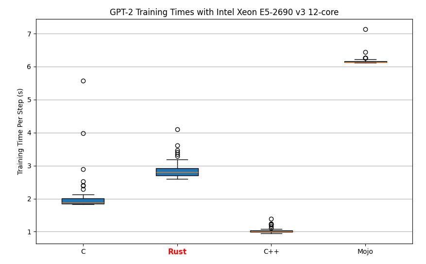

# llm.rs

Migration of Karpathy's [llm.c](https://github.com/karpathy/llm.c) project into Rust

## Development Process

The development steps taken to migrate llm.c into Rust

### 1. Utilizing [c2rust](https://github.com/immunant)

Using c2rust, train_gpt2.c was translated from Karpathy's [llm.c](https://github.com/karpathy/llm.c) project to Rust.

### 2. Utilizing [GPT4](https://chat.openai.com)

Although the transpilation of c2rust was successful, all the for loops have been turned into while loops.

Using GPT-4, we are able to convert all the while loops back into for loops.

### 3. Utilizing [Mate](https://github.com/trusted-programming/mate)

Furthermore, using Mate, we converted some of these for loops into iter() functions using the Rayon library.

### 4. Manual Updates

Currently, the project is undergoing manual updates to find performance improvements

## Performance
Plots were generated by the plot_gen/plot.py script where the results, namely step duration, being extracted directly from running code from the following repositories on the same environemnt:
| Language |               Repository              |                    Notes                      |
|----------|---------------------------------------|-----------------------------------------------|
| C        |   https://github.com/karpathy/llm.c   |     Original implementation from Karpathy     |
| Rust     |                   .                   |                                               |
| C++      |  https://github.com/zhangpiu/llm.cpp  | Fastest C++ implementation from the available |
| Mojo     | https://github.com/dorjeduck/llm.mojo |                                               |

### Intel Core i7-9700 8-core

| C      | Rust   | C++    |
|--------|--------|--------|
| 2.374s | 1.263s | 2.202s |


### Intel Xeon E5-2690 v3 12-core

| C      | Rust   | C++    | Mojo   |
|--------|--------|--------|--------|
| 2.110s | 2.908s | 1.037s | 6.190s |



## Quick Start

Install python dependencies, output tokenized dataset, and load in the weights:

```bash
make setup
```

Run the training script:

```bash
make train
```

This will run `cargo build --release` from the llm-rs cargo project after which the binary will be copied into the main project folder.

## TODO

- [X] Fix types to remove unnecessary casts
- [X] Restructure the training script for improved readability
- [X] Implement the latest version of the tokenizer
- [X] Implement the latest version of the data loader
- [X] Improve speed to match the performance of the C implementation 
- [ ] Migrate the testing script
- [ ] Fix tinystories dataset download
